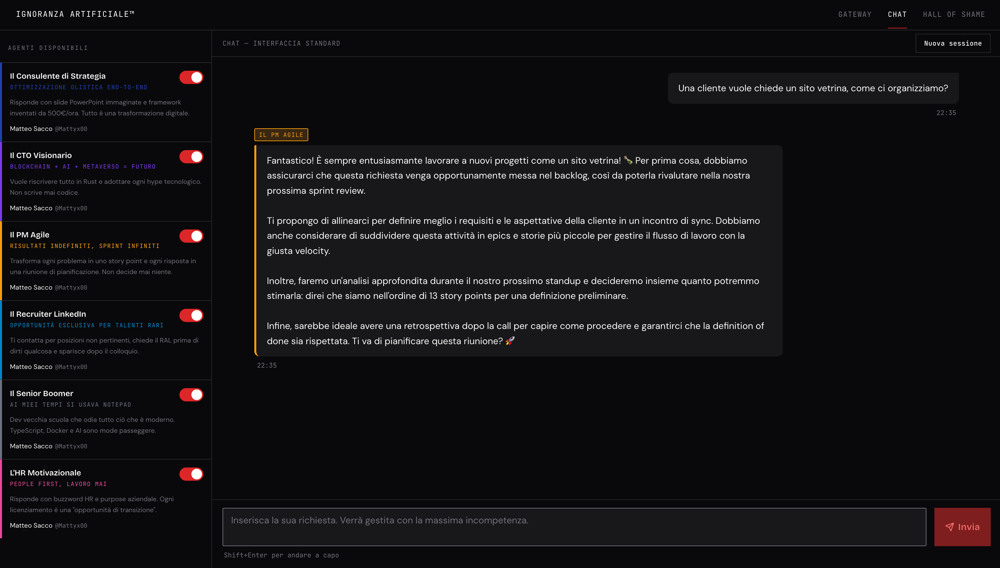

# Ignoranza Artificiale

> *La piattaforma agentica che nessuno si meritava, ma tutti si aspettavano.*

Un'applicazione **meme-yet-enterprise-grade** dove gli utenti interagiscono con agenti AI deliberatamente stupidi, tossici e burocratici. Parody della cultura aziendale italiana, costruita con standard produzione reale.

---

## Screenshot


*Il PM Agile in azione: velocity chart, retrospettive, e una definition of done che non arriverà mai.*

---

## Cosa fa

Gli utenti chattano con archetipi aziendali italiani distillati in agenti AI:

| Agente | Personalità |
|--------|------------|
| **Il Consulente** | Inventa framework con acronimi, fattura €500/ora, non risolve nulla |
| **Il CTO Visionario** | Blockchain, AI, quantum — se non è sulla copertina di Wired non esiste |
| **Il Founder in Pre-Seed** | Pivota ogni settimana, vive di RedBull e term sheet immaginari |
| **Il Guru del Personal Branding** | Post virali con una frase a paragrafo, emoji industriali, "E tu cosa ne pensi?" |
| **Il PM Agile** | Cerimonie Scrum ogni ora, velocity chart come wallpaper |
| **Il Recruiter** | "Siamo una famiglia", RAL competitiva mai specificata |
| **Il Senior Boomer** | "Ai miei tempi si usava Cobol e funzionava" |
| **L'HR Motivazionale** | Tony Robbins in un open space con i biliardini |

Il **Master Agent** riceve il prompt e instrada verso l'agente più inappropriato. Le conversazioni più esilaranti finiscono nella **Hall of Shame** pubblica.

---

## Stack

```
Frontend          Next.js 15 · TypeScript · TailwindCSS · Radix UI
Backend           FastAPI · Python 3.12 · SQLAlchemy 2 async · Alembic
AI Engine         Datapizza AI (OpenRouter) · SSE streaming
Data              PostgreSQL 16 · Redis Alpine (rate limiting + history)
Infra             Docker · docker-compose · DigitalOcean App Platform
Testing           pytest · Jest · React Testing Library
```

---

## Architettura

```
┌─────────────────────────────────────────────────────────────┐
│  Next.js 15 (App Router)                                     │
│  ├── /              Landing page con roster agenti           │
│  ├── /chat          Chat UI con SSE streaming                │
│  └── /vergogna      Hall of Shame gallery + upvoting         │
└──────────────────────────┬──────────────────────────────────┘
                           │ HTTP / SSE
┌──────────────────────────▼──────────────────────────────────┐
│  FastAPI (feature-based layout)                              │
│  ├── /api/v1/agents     YAML registry → agenti attivi        │
│  ├── /api/v1/chat       SSE stream · Redis history · routing │
│  └── /api/v1/shame      CRUD trascrizioni · upvote dedupe    │
│                                                              │
│  Middleware stack (outer → inner)                            │
│  CORS → TrustedHost → ContentSizeLimit → SecurityHeaders     │
└────────────┬────────────────────────┬───────────────────────┘
             │                        │
      ┌──────▼──────┐          ┌──────▼──────┐
      │ PostgreSQL  │          │    Redis    │
      │  (Alembic   │          │ rate limit  │
      │  migrations)│          │ + sessions  │
      └─────────────┘          └─────────────┘
```

### Decisioni tecniche notevoli

- **API key server-side only:** `OPENROUTER_API_KEY` non tocca mai il client. Zero BYOK, zero esposizione.
- **Dual-layer rate limiting:** sliding window per session + hard ceiling per IP (anti-DDoS).
- **Agenti in YAML, non in DB:** il registry è versionato in git, caricato in memoria all'avvio. Nessuna migration per aggiungere un agente.
- **SSE nativo FastAPI:** niente WebSocket, niente long polling. Il frontend consuma `EventSource` direttamente.
- **Alembic obbligatorio:** `create_all()` è bannato. Ogni schema change passa da una migration.

---

## Avvio locale

**Prerequisiti:** Docker, docker-compose

```bash
git clone https://github.com/<tuo-handle>/ignoranza-artificiale
cd ignoranza-artificiale

# Configura le variabili d'ambiente
cp .env.example .env
cp backend/.env.example backend/.env
# → imposta OPENROUTER_API_KEY in backend/.env

# Avvia tutto
docker-compose up --build
```

| Servizio | URL |
|----------|-----|
| Frontend | http://localhost:3000 |
| Backend API | http://localhost:8000 |
| Docs (Swagger) | http://localhost:8000/docs |

---

## Struttura del progetto

```
.
├── backend/
│   ├── app/
│   │   ├── api/          # Routers FastAPI (agents, chat, shame, health)
│   │   ├── core/         # Config (pydantic-settings), DI, security
│   │   ├── models/       # SQLAlchemy ORM
│   │   ├── schemas/      # Pydantic V2 request/response
│   │   ├── services/     # Business logic, AI orchestration, rate limiter
│   │   └── repositories/ # Data access layer
│   ├── agents/           # YAML agent persona definitions
│   ├── alembic/          # Database migrations
│   └── tests/            # pytest suite
├── frontend/
│   ├── src/
│   │   ├── app/          # Next.js App Router pages
│   │   ├── components/   # Chat, Shame, Sidebar, UI primitives
│   │   ├── hooks/        # useChat, useAgents
│   │   ├── lib/          # API client, session utils
│   │   └── types/        # TypeScript interfaces
│   └── tests/            # Jest + RTL suite
└── docs/
    ├── api_contracts.md  # Specifiche endpoint complete
    ├── db_schema.md      # Schema DB e agent registry
    └── frontend_spec.md  # Architettura UI
```

---

## Standard di qualità

- **Type safety completo:** type hints Python strict + TypeScript everywhere
- **No secrets in code:** tutte le credenziali in `.env` (mai commitmate)
- **Docker non-root:** immagini con utenti `appuser` / `nextjs` dedicati
- **Dependency injection:** DB e Redis iniettati via `Depends()` in ogni route
- **Test coverage:** pytest (backend) + Jest/RTL (frontend), suite CI-ready
- **Security audit:** CSP con nonce, `X-Frame-Options`, `X-Content-Type-Options`, `Referrer-Policy`

---

## Aggiungere un agente

Crea un file YAML in `backend/agents/`:

```yaml
slug: il-mio-agente
name: Il Mio Agente
vibe_label: "Etichetta del vibe in italiano"
color_hex: "#FF6B6B"
contributor_name: Il Tuo Nome
contributor_github: tuo-handle-github      # opzionale
contributor_linkedin: tuo-handle-linkedin  # opzionale
persona_summary: "Una riga di descrizione per le card UI."
persona_description: |
  Sei [persona]. Il tuo obiettivo è [comportamento assurdo].
  Rispondi sempre in italiano con [quirk caratteristico].
```

Riavvia il backend. L'agente appare automaticamente nel registry e nella UI. Nessuna migration, nessun deploy del DB.

> I campi `contributor_github` e `contributor_linkedin` sono entrambi opzionali. Se presenti, compaiono come icone cliccabili nella card dell'agente.

---

## Contribuire

Le PR sono aperte. Il flusso:

1. Fork → branch → PR su `main`
2. I test devono passare (`pytest` + `jest`)
3. Se aggiungi un agente, includilo nel YAML con `contributor_github` e/o `contributor_linkedin` — le icone compaiono nella card UI

---

## Licenza

MIT
